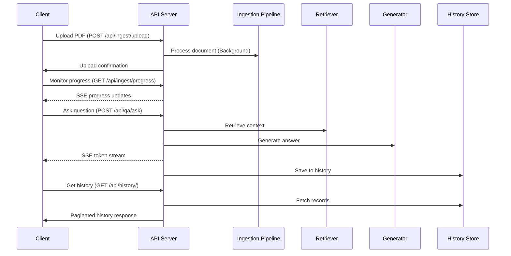

# SocioGraph Phase 6 Implementation Summary

## Overview

Phase 6 focused on completing the FastAPI backend implementation by building upon the Q&A functionality established in Phase 5. This phase delivered a comprehensive set of API endpoints for document management, query processing, history tracking, and real-time communication through both Server-Sent Events (SSE) and WebSockets.

## 🎯 Key Objectives Achieved

1. **API Integration** - Successfully integrated all backend components through a unified API layer
2. **Enhanced Routing** - Implemented specialized routers for different functional areas
3. **Real-time Communication** - Added WebSocket support with heartbeat mechanisms
4. **Progress Streaming** - Created Server-Sent Events (SSE) endpoints with proper async handling
5. **History Management** - Built comprehensive history tracking and management API
6. **Error Handling** - Implemented robust error handling across all endpoints
7. **Documentation** - Added detailed API documentation with Swagger UI integration

## 🛠️ Implementation Details

### 1. Document Ingestion API

The `/api/ingest` endpoints provide document uploading, processing, and progress tracking capabilities:

```python
# Key endpoints in ingest.py
@router.post("/reset")               # Reset the corpus by clearing all data stores
@router.post("/upload")              # Upload a PDF file for processing
@router.post("/process")             # Manually trigger processing of all files
@router.get("/progress")             # Stream progress updates via SSE
```

#### Progress Streaming Implementation

A particularly challenging aspect was implementing the progress streaming endpoint with proper async handling:

```python
@router.get("/progress")
async def progress():
    """Stream progress updates from the ingestion pipeline."""
    
    async def progress_stream():
        """Generate progress updates as a stream with heartbeats."""
        heartbeat_interval = 5  # seconds
        last_heartbeat = time.time()
        
        try:
            # Stream updates with heartbeats
            async for update in sync_to_async_generator(process_all()):
                # Send the actual update
                yield f"data: {json.dumps(update)}\n\n"
                
                # Add heartbeat if needed
                current_time = time.time()
                if current_time - last_heartbeat > heartbeat_interval:
                    last_heartbeat = current_time
                    yield f"event: heartbeat\ndata: {current_time}\n\n"
                    
            # Final heartbeat when done
            yield f"event: heartbeat\ndata: {time.time()}\n\n"
            
        except Exception as e:
            _logger.error(f"Error in progress stream: {str(e)}")
            yield f"event: error\ndata: {json.dumps({'error': str(e)})}\n\n"
    
    return StreamingResponse(
        progress_stream(),
        media_type="text/event-stream"
    )
```

This implementation solves several critical challenges:
- Converting synchronous generators to async streams
- Adding heartbeat messages to prevent connection timeouts
- Proper error handling and reporting through the event stream

### 2. Question & Answer API

The Q&A endpoints provide both REST and WebSocket interfaces for interacting with the knowledge base:

```python
# REST endpoints in qa.py
@router.post("/ask")                 # Ask a question with streaming response (SSE)
@router.get("/history")              # Get recent Q&A history
@router.get("/stats")                # Get Q&A statistics

# WebSocket endpoints in websocket_new.py
@router.websocket("/qa")             # Real-time Q&A with token streaming
@router.websocket("/processing/{document_id}") # Document processing status updates
@router.websocket("/monitor")        # System monitoring and notifications
```

### 3. History Management API

The history API provides comprehensive management of query history:

```python
# Endpoints in history_new.py
@router.get("/")                     # Get paginated history with search
@router.get("/stats")                # Get history statistics
@router.get("/record/{record_id}")   # Get a specific history record
@router.delete("/record/{record_id}") # Delete a specific history record
@router.delete("/clear")             # Clear all history records
```

### 4. Real-time Communication

WebSocket support was implemented with several critical features:

```python
# Connection management in websocket_new.py
class ConnectionManager:
    """Manages WebSocket connections."""
    
    async def connect(self, websocket: WebSocket, connection_type: str = "general", identifier: str = None):
        # Handle connection establishment
        
    def disconnect(self, websocket: WebSocket):
        # Handle disconnection
        
    async def send_json_message(self, data: Dict[str, Any], websocket: WebSocket):
        # Send JSON data to client
        
    async def broadcast_to_processing(self, document_id: str, message: Dict[str, Any]):
        # Broadcast to multiple clients
```

Heartbeat functionality was added to maintain long-running connections:

```python
async def send_periodic_heartbeat(websocket: WebSocket, interval: int = 30):
    """Send periodic heartbeats to keep the connection alive."""
    try:
        while True:
            await asyncio.sleep(interval)
            await websocket.send_json({
                "type": "heartbeat",
                "timestamp": datetime.now().isoformat()
            })
    except (asyncio.CancelledError, WebSocketDisconnect):
        # Task was cancelled or connection was closed
        pass
    except Exception as e:
        _logger.error(f"Error in heartbeat task: {str(e)}")
```

## 🧪 Testing & Validation

Comprehensive tests were implemented to validate all API endpoints:

```python
# Key test classes in test_api.py
class TestIngestEndpoints:        # Tests for document ingestion endpoints
class TestQAEndpoints:            # Tests for Q&A endpoints
class TestHistoryEndpoints:       # Tests for history management endpoints
class TestWebSocketEndpoints:     # Tests for WebSocket functionality
class TestCORSMiddleware:         # Tests for CORS configuration
class TestIntegrationFlows:       # End-to-end integration tests
```

## 🔄 API Flow Diagram



## 🚀 Performance Optimizations

Several performance optimizations were implemented:

1. **Async Processing** - Background tasks for document processing
2. **Heartbeat Mechanism** - Prevents timeouts in long-running connections
3. **Efficient Connection Management** - WebSocket connection pooling
4. **CORS Configuration** - Optimized cross-origin resource sharing
5. **Static File Optimization** - Improved path handling for document serving

## 🔒 Security Enhancements

Security considerations implemented in this phase:

1. **CORS Headers** - Properly configured for controlled cross-origin access
2. **Input Validation** - Type checking and constraints on all API inputs
3. **Error Handling** - Secure error messages that don't expose internals
4. **Path Traversal Prevention** - Robust path handling for file operations

## 📋 API Documentation

All endpoints are documented through FastAPI's automatic OpenAPI documentation:

- **Swagger UI** - Available at `/docs` endpoint
- **ReDoc** - Available at `/redoc` endpoint
- **API Tags** - Organized endpoints by functional category

## 🧩 Future Enhancements

While Phase 6 completed the core API functionality, several areas are identified for future enhancement:

1. **Authentication & Authorization** - User management and API key authentication
2. **Rate Limiting** - Prevent API abuse and ensure fair resource allocation
3. **Caching Layer** - Response caching for frequently accessed resources
4. **Advanced Monitoring** - Enhanced metrics collection and visualization
5. **GraphQL API** - Alternative API for more flexible data querying

## 🏁 Conclusion

Phase 6 successfully delivered a complete FastAPI backend with comprehensive endpoint coverage, real-time communication capabilities, and robust error handling. The implementation provides a solid foundation for future frontend integration and additional feature development.

The system is now ready for Phase 7, which will focus on developing the frontend user interface and integrating it with the backend API.
